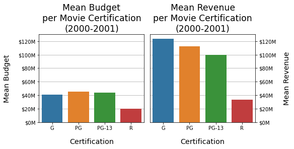
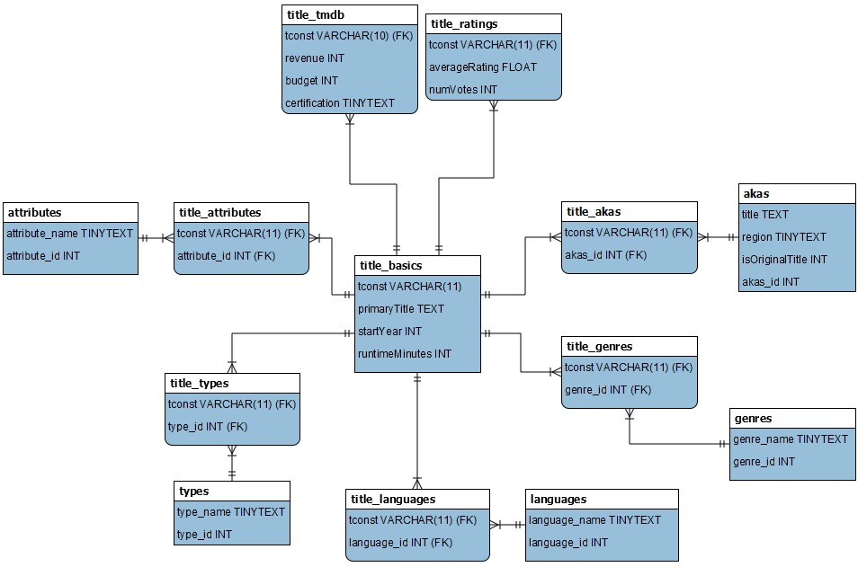

# Analysis of Successful Movies
 Elements of successful movies are analyzed and recommended

## Notebook 1
The [Notebook-1](Notebook-1.ipynb) retrieves data from IMDb and reduces the data set for this project to meet the following criteria:
* Exclude any movie with missing values for genre or runtime
* Include only full-length movies (titleType = "movie").
* Include only fictional movies (not from documentary genre)
* Include only movies that were released 2000 - 2021 (include 2000 and 2021)
* Include only movies that were released in the United States

The resulting data sets are then saved as compressed csv files (extension .csv.gz) in the Data folder.

## Notebook 2
The [Notebook-2](Notebook-2.ipynb) retrieves data from TMDB for movies collected in [Notebook-1](Notebook-1.ipynb). Currently, only movies from 2000-2001 are having data retrieved.

## Notebook 3
The [Notebook-3](Notebook-3.ipynb) performs some simple EDA, examining budget and revenue. The mean values of budget and revenue for each of the MPAA ratings of interest (G/PG/PG-13/R) are shown in the graph below.

## Notebook 4
The [Notebook-4](Notebook-4.ipynb) normalized the data tables and saves them as a MySQL database. The ERD is shown here:

